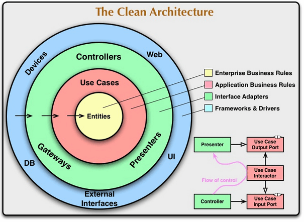

# Introduction

This is the implementation of clean architecture by [Uncle Bob](https://blog.cleancoder.com/uncle-bob/2012/08/13/the-clean-architecture.html). We can implement this project to make applications with many modules and components. First, we must prepare some libraries for supporting our project like an injector, API consumes like [dio](https://pub.dev/packages/dio), and many other libraries we must install. In this case, I made a [Facebook](https://web.facebook.com/?\_rdc=1&\_rdr) clone with [rest API](https://www.redhat.com/en/topics/api/what-is-a-rest-api) and you can clone it anytime and feel free to wait for my update app to make sure the app works properly.

Clean Architecture combines a group of practices that produce systems with the following characteristics:&#x20;

* [x] Testable
* [x] UI-independent (the UI can easily be changed without changing the system)
* [x] Independent of databases, frameworks, external agencies, and libraries

## Why?

The general objective is to decrease the application coupling so that we can reuse business rules whenever we want.

We need to test each business rule for the application in isolation and ensure that each rule is being applied without interference from any externalities, or objects that we have no control over, but this is something that developers already know.

We need each layer of the application to be isolated and not have knowledge of how they work, for example, the core of the application has no need to know which database that it needs to access, or which SPI needs to make a request or something it just needs to understand about the business that is being built.

If we have a version of the WEB application and it will have to be built new or modified the same way for desktop or mobile, this will be a difficult task. If we have a clean architecture, it shouldn't be a problem.


Video by [IT konekt](https://www.youtube.com/channel/UCubO9y-XXVseyNjYUQtrqhw)


## Reviews

* Great forum to ask and develop something new. ([link](https://flutter.dev/community))
* Thank you for sharing the wonderful tutorial from Rezky Aulia Pratama. ([link](https://github.com/rezkyauliapratama))
* Thank you for sharing a lot of great tutorials Reso Coder. ([link](https://resocoder.com))
* Great simple code tutorial by Filled Stack. ([link](https://www.filledstacks.com))
* Found a great article on how to handle DIO interceptor. ([link](https://dev.to/ashishrawat2911/handling-network-calls-and-exceptions-in-flutter-54me))
* Great article about clean architecture in React by Luís Junqueira. ([link](https://www.growin.com/blog/how-to-use-a-clean-architecture-with-react/))

## Share

Share URL: [https://imun.gitbook.io/flutter/](https://imun.gitbook.io/flutter/)

